# INFORME PRACTICA 4
## Arrays, tuplas y enumerados
### ALBERTO RIOS DE LA ROSA
### alu0101235929@ull.edu.es

### INTRODUCCIÓN

Esta práctica tiene como objetivo principal continuar en la realización de ejercicios de programación en TypeScript, centrándonos más en ejercicios relacionados con arrays, tuplas y enumerandos, para así seguir evolucionando en nuestro aprendizaje. Además en esta práctica había que elaborar el proyecto creando las carpetas necesarias para crear la documentación de cada uno de los ejercicios en TypeScript y para poder realizar la práctica mediante el método de pruebas TDD. Primero explicaremos en un principio como crear este método de manera breve, y más tarde mostraremos la solución de cada uno de los ejercicios propuestos con una breve explicación de cada uno y una captura de pantalla en el que se muestra que se han superado las distintas pruebas de ese ejercicio superada junto al link de donde se crearon las pruebas. Si desea leer los enunciados de cada ejercicio los podrás encontrar pinchando [aqui](https://ull-esit-inf-dsi-2021.github.io/prct04-arrays-tuples-enums/)

### CREACION DEL PROYECTO CON LA ESTRUCTURA REQUERIDA

Para crear el proyecto primero debemos realizar un git clone, de la estructura de git dada para el desarrollo y la entrega del mismo, mas tarde al igual que la práctica anterior debemos seguir los pasos de la creacion de un proyecto para trabajar en TypeScript a partir del siguiente [enlace](https://ull-esit-inf-dsi-2021.github.io/typescript-theory/typescript-project-setup.html). Ya creado el proyecto inicial, lo siguiente que vamos a crear es los ficheros y carpetas necesarios para poder elaborar la documentación de cada uno de los ejercicios, encontrandolos en este [video](https://drive.google.com/file/d/19LLLCuWg7u0TjjKz9q8ZhOXgbrKtPUme/view). Después por último para ya tener la estructura de nuestro proyecto terminada, a través de mocha y chai, crearemos lo necesario para poder seguir la metodología TDD, en el que se desarrolla la prueba y luego el método, teniendolo disponible en este [video](https://drive.google.com/file/d/1-z1oNOZP70WBDyhaaUijjHvFtqd6eAmJ/view). Para hacernos una idea de la estructura final del proyecto, debe ser algo parecido a lo siguiente:

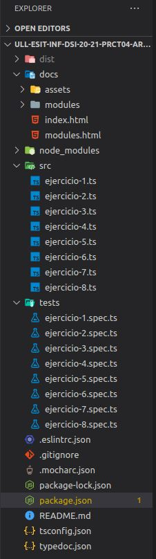 

### ELABORACIÓN DE LOS EJERCICIOS

### Ejercicio 1 - Decodificar resistencias

***Código resuelto*** = [Solución](https://github.com/ULL-ESIT-INF-DSI-2021/ull-esit-inf-dsi-20-21-prct04-arrays-tuples-enums-Espinette/blob/master/src/ejercicio-1.ts)

***Resumen enunciado*** 
 
Se nos pide crear una función llamada `decodeResistor` que deber recibir como parámetros los nombres de los colores de una resistencia, cada color representa un número, y lo que se espera que devuelva es un número de dos dígitos indicando el valor de la resistencia. Además en el caso que reciba más de dos colores deberá despreciar el resto de números, ya que solo se requieren dos dígitos. El número asociado a cada color es:

 - Negro: 0
 - Marrón: 1
 - Rojo: 2
 - Naranja: 3 
 - Amarillo: 4 
 - Verde: 5
 - Azul: 6
 - Violeta: 7
 - Gris: 8
 - Blanco: 9

***Captura y explicación de la función resuelta***
 
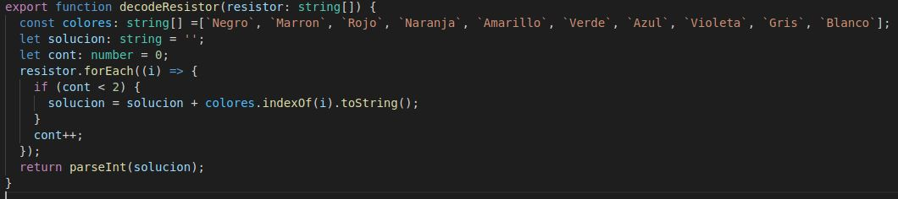 

Creamos la función que recibirá como parámetros un array de colores, dentro de ella creamos otro array donde estarán todos los colores en el orden del enunciado puesto que el número asociado coincide con la posición en la que se encuentra. Luego realizaremos un `forEach` que lo que hará es analizar cada alemento del array recibido y y siempre que su posición sea menor que 2, se realizará `colores.indexOf(i).toString()`, que lo que hará es obtener la posicion en la que se encuentra ese elemento, y se añadirá a una cadena, finalmente retornará esa cadena pasada a entero gracias a la función `parseInt`.

***Expectativa del programa***

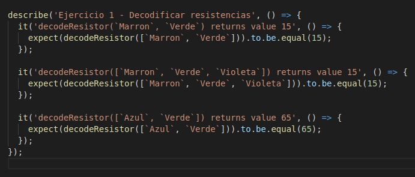 

### Ejercicio 2 - Palabras encadenadas en un array

***Código resuelto*** = [Solución](https://github.com/ULL-ESIT-INF-DSI-2021/ull-esit-inf-dsi-20-21-prct04-arrays-tuples-enums-Espinette/blob/master/src/ejercicio-2.ts)

***Resumen enunciado*** 
 
La función `meshArray` recibirá un array que contiene cadenas de textos y lo que debe de hacer es comprobar si están encadenadas una palabra del array con la siguiente. Esta función podrá devolver:

 - “Error al encadenar" si las cadenas del array no están encadenadas.
 - Una cadena de texto que contenga las letras que encadenan las palabras del array. A priori no sabe cuantas letras encadenadas tendrán en común, pero al menos será una.

Algunos ejemplos son:

 1. [“allow”, “lowering”, “ringmaster”, “terror”] –> “lowringter”
 2. [“kingdom”, “dominator”, “notorious”, “usual”, “allegory”] –> “Error al encadenar”

***Captura y explicación de la función resuelta***
 
 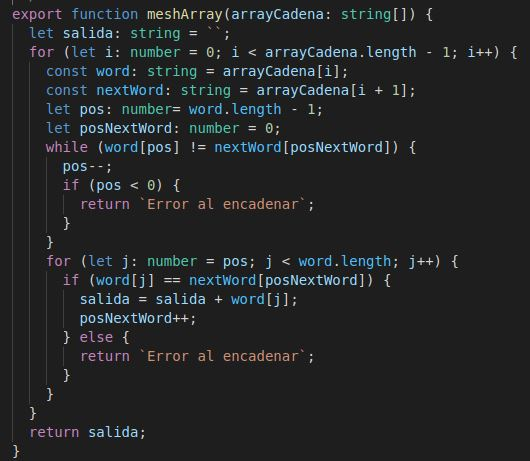 

La función recibirá un array de cadena de textos, dentro realizaremos un bucle for que recorrerá el array, y crearemos la variable *word* y la *nextWord* que apuntaran a la cadena actual con la siguiente y lo que haremos es un bucle while dentro que irá desde la última letra de la primera palabra comprobando si coincide con la primera letra de la siguiente palabra e irá decrementando la letra de la primera palbra hasta que coincida, de encontrar una coincidencia retorna `Error al encadenar`. Luego tendremos un bucle for que ira desde la posicion en la que encontró dos letras iguales e iran avanzando y comprobando letra por letra, en el caso de que recorra hasta el final de la palabra las añade a un array de encontrar un error de coincidencia, retornará `Error al encadenar`. Por último si el todas las palabras se pueden encadenar retornará una cadena con todas las letras usadas a encadenar.

***Expectativa del programa***

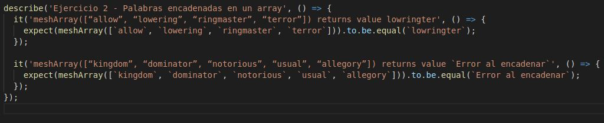 

### Ejercicio 3 - Calcular la media y concatenar cadenas

***Código resuelto*** = [Solución](https://github.com/ULL-ESIT-INF-DSI-2021/ull-esit-inf-dsi-20-21-prct04-arrays-tuples-enums-Espinette/blob/master/src/ejercicio-3.ts)

***Resumen enunciado*** 
 
Se pide crear una funcion con nombre `meanAndConcatenate` que deberá recibir un array de números o carácteres de texto, esta analizará cada elemento del array y lo que hará es devolver:

 - La media de los valores numéricos.
 - Una cadena resultado de la concatenación de caracteres del array recibido.

Un ejemplo de salida puede ser el siguiente:

`['u', 6, 'd', 1, 'i', 'w', 6, 's', 't', 4, 'a', 6, 'g', 1, 2, 'w', 8, 'o', 2, 0]` -> `[3.6, "udiwstagwo"]`

***Captura y explicación de la función resuelta***
 
 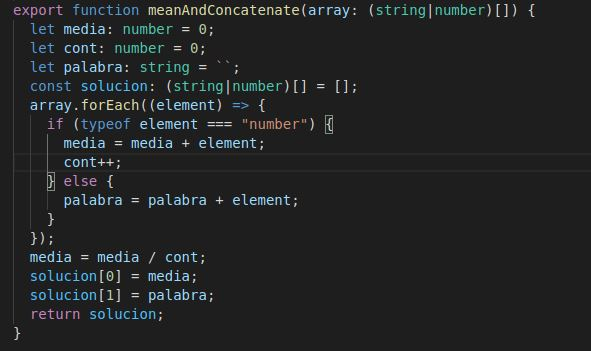 

La función a realizar recibirá lo indicado en el enunciado, luego realizaremos un `foEach` para acceder al contenido de cada posicion del array donde dentro de este crearemos un bucle if en el que se comprobará el tipo del elemento a analizar. En el caso de ser un número lo añadirá a un sumatorio y se incrementará un contador para saber cuantos se suman y tras terminar el bucle dividirlo por esa cantidad para obtener la media, luego tenemos el otro caso en el que será un string, por lo que se irá añadiendo a una cadena juntando todas las letras en una palabra. Finalmente se mostrará un array de tamaño 2 en el que el primer elemento será la media y el segundo la palabra.

***Expectativa del programa***

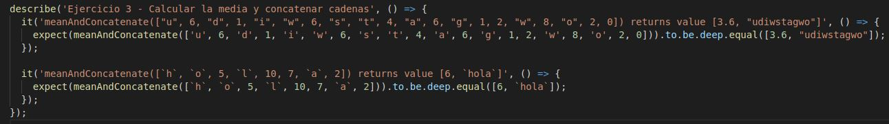 

### Ejercicio 4 - Mover los ceros al final

***Código resuelto*** = [Solución](https://github.com/ULL-ESIT-INF-DSI-2021/ull-esit-inf-dsi-20-21-prct04-arrays-tuples-enums-Espinette/blob/master/src/ejercicio-4.ts)

***Resumen enunciado*** 

Se pide crear una función `moveZeros` que recibirá un array de números y deberá reotornar ese mismo array pero esta vez con todos los ceros desplazados al final del array. Un ejemplo de programa es:

`moveZeros([1, 0, 1, 2, 0, 1, 3]) -> [1, 1, 2, 1, 3, 0, 0]`.

***Captura y explicación de la función resuelta***
 
 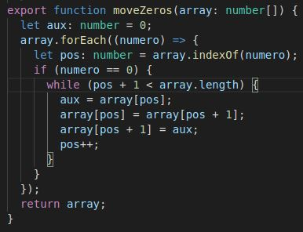 

La función recibira el array mencionado y lo que haremos es un `forEach` y en el caso de que el numero a analizar sea un 0, deba desplazarlo dicho número al final del array, con un bucle while que recorra desde la posicion en la que se encuentra el 0 hasta el final del array y retornará el array modificado.

***Expectativa del programa***

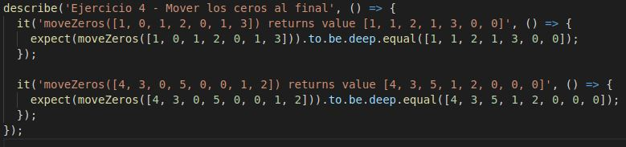 

### Ejercicio 5 - Factoría de multiplicaciones

***Código resuelto*** = [Solución](https://github.com/ULL-ESIT-INF-DSI-2021/ull-esit-inf-dsi-20-21-prct04-arrays-tuples-enums-Espinette/blob/master/src/ejercicio-5.ts)

***Resumen enunciado*** 
 
Se pide crear una función `multiplyAll` esta deberá devolver como resultado otra función que toma como argumento un único valor numérico y devuelve un nuevo array. El array devuelto por la segunda función debe ser el resultado de la multiplicación de los números del array por el valor numérico que recibe la segunda función. Además, no se debe modificar el primer array. Un ejemplo sería:

`multiplyAll([2, 6, 8])(3)  -> [6, 18, 24]`.

***Captura y explicación de la función resuelta***
 
 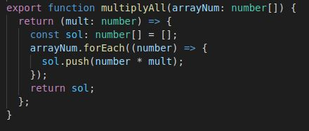 

Una vez creada la función le hacemos un return en el que en el mismo creará un función anónima que recibirá el valor por el que se debe multiplicar cada elemento del array y dentro de la función realizaremos un forEach que recorra el array en el que realizaremos un push a un nuevo array con el valor del numero actual por el multiplicador establecido. Y retornaremos dicho array nuevo creado. 

***Expectativa del programa***

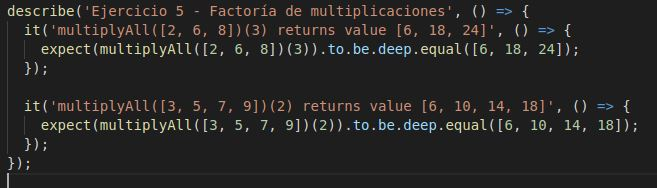 

### Ejercicio 6 - Puntos bi-dimensionales

***Código resuelto*** = [Solución](https://github.com/ULL-ESIT-INF-DSI-2021/ull-esit-inf-dsi-20-21-prct04-arrays-tuples-enums-Espinette/blob/master/src/ejercicio-6.ts)

***Resumen enunciado*** 

Se pide definir un punto bi-dimensional en el que a partir de ese tipo creado definir las siguientes funciones:

 1. Sumar y restar dos puntos coordenada a coordenada.
 2. Calcular el producto de un punto por un número.
 3. Calcular la distancia euclídea entre dos puntos.

***Captura y explicación de la función resuelta***
 
 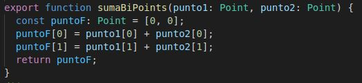 
 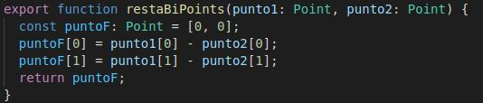 
 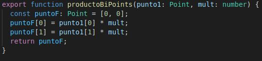 
 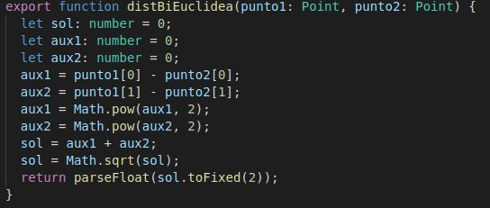 

El tipo de dato creado era un array con de dos elementos de tipo number:

`type Point = [number, number];`

 - Funcion suma:
 
 Recibirá dos puntos, la funcion retornará un nuevo punto la suma primer elemento de ambos puntos y el segundo elemento de ambos
 
 - Funcion resta:

 Recibirá dos puntos, la funcion retornará un nuevo punto la resta primer elemento de ambos puntos y el segundo elemento de ambos

 - Funcion producto:

 Recibirá un punto y un valor numérico que será el valor a multiplicar, la funcion retornará un nuevo punto con el valor de cada posición multiplicado.
 
 - Funcion distancia Euclidea 

 Recibirá dos puntos y retornara un valor correspondiente a la distancia Euclidea entre esos dos puntos. Como bien se ve la distancia euclidea se resuelve a partir de la formula que podras encontrar [aquí](https://silvercorp.wordpress.com/2016/09/15/distancia-euclidiana-en-python/)
 
***Expectativa del programa***

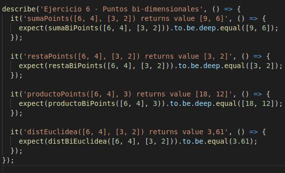 

### Ejercicio 7 - Puntos n-dimensionales

***Código resuelto*** = [Solución](https://github.com/ULL-ESIT-INF-DSI-2021/ull-esit-inf-dsi-20-21-prct04-arrays-tuples-enums-Espinette/blob/master/src/ejercicio-7.ts)

***Resumen enunciado*** 

Se pide definir un punto de n-dimensiones con un mínimo de 3 en el que a partir de ese tipo creado definir las siguientes funciones:

 1. Sumar y restar dos puntos coordenada a coordenada.
 2. Calcular el producto de un punto por un número.
 3. Calcular la distancia euclídea entre dos puntos.
***Captura y explicación de la función resuelta***
 
 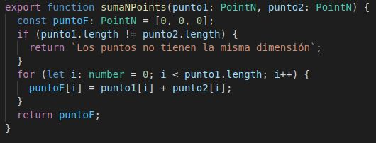
 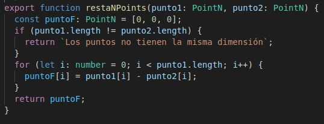 
 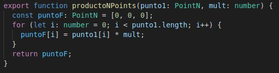 
 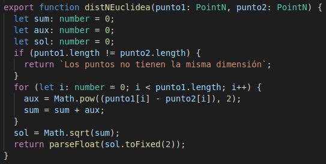 

El tipo de dato creado era un array con de dos elementos de tipo number:

`type PointN = [number, number, number, ...number[]];`

 - Funcion suma:
 
 Recibirá dos puntos del tipo definido con la condición de que deben tener el mismo tamaño, la funcion retornará un nuevo punto del mismo tamaño, la suma de cada de ambos puntos en las mismas posiciones.
 
 - Funcion resta:

 Recibirá dos puntos del tipo definido con la condición de que deben tener el mismo tamaño, la funcion retornará un nuevo punto del mismo tamaño, la resta de cada de ambos puntos en las mismas posiciones.

 - Funcion producto:

 Recibirá un punto del tipo definido y un multiplicado, la funcion retornará un nuevo punto del mismo tamaño, en el que se multiplique cada elemento por el multiplicador
 
 - Funcion distancia Euclidea 

 Recibirá dos puntos del tipo definido con la condición de que deben tener el mismo tamaño y retornara un valor correspondiente a la distancia Euclidea entre esos dos puntos. Como bien se ve la distancia euclidea se resuelve a partir de la formula que podras encontrar [aquí](https://silvercorp.wordpress.com/2016/09/15/distancia-euclidiana-en-python/)

***Expectativa del programa***

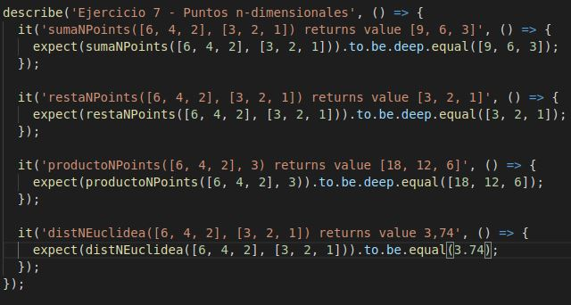 

### Ejercicio 8 - El agente

***Código resuelto*** = [Solución](https://github.com/ULL-ESIT-INF-DSI-2021/ull-esit-inf-dsi-20-21-prct04-arrays-tuples-enums-Espinette/blob/master/src/ejercicio-8.ts)

***Resumen enunciado*** 

Crear una función `agent` en el que deberá recibir el tamaño del tablero, así como un punto inicial y un punto final. El objetivo es calcular la ruta necesaria para llegar desde el punto inicial hasta el punto final sin permitir movimientos en diagonal. Deberá reotnar un array que incluya los pasos que tiene que realizar para llegar a destino. Estos movimientos serán Norte, Sur, Este y Oeste.

Un ejemplo de ejecución sería:

```TypeScript
initialPoint = (1, 3)
endPoint = (3, 5)
agent(X, Y, initialPoint, endPoint) // => [North, North, East, East]
```

***Captura y explicación de la función resuelta***
 
 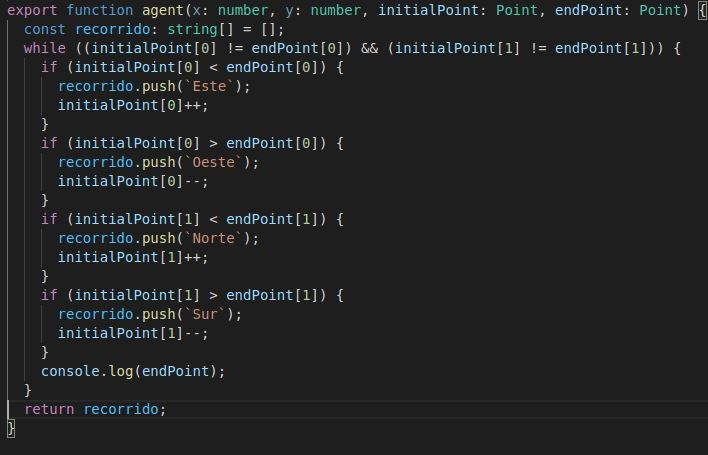 

Primero creamos un tipo point igual que en el ejercicio 6. Lo que realizaremos es un bucle while que mientra destino y final no fueran el mismo punto, y dentro de este 4 if para averiguar por donde desplazarse y en funcion del que entre añadir a un array la dirección que toma y e ir incrementando o decrementando el punto inicial a la posición que corresponde en ese momento. Finalmente retornará el array recorrido final, con la trayectoria final.

***Expectativa del programa***

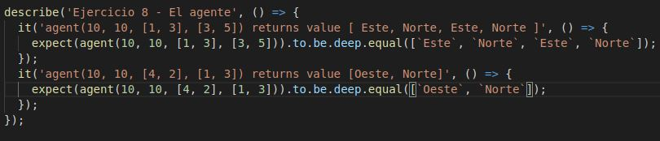 

### Visualización de pruebas realizadas correctamente

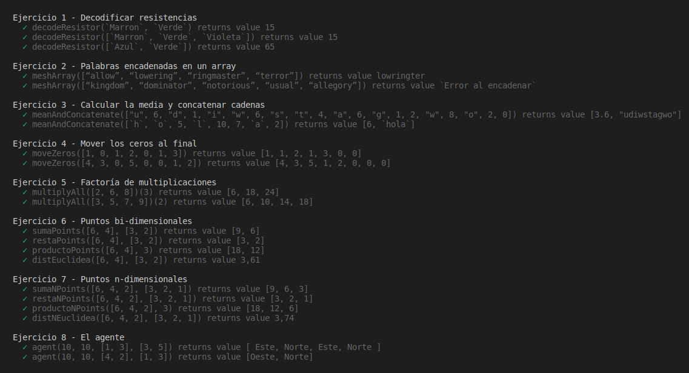 

### CONCLUSIONES

En esta práctica hemos aprendido no solo a realizar nuevos ejercicios en este caso enfocados más a arrays y tuplas, si no también hemos podido saber como se genera la documentación de un programa, a su vez también averiguamos como realizar los test para comprobar si se genera correctamente lo requerido en la práctica. Bajo mi punto de vista esta práctica nos ha servido para seguir mejorando en la programación TypeScript pero además hemos aprendido a como mejorar la presentación y la estructura de nuestros ejercicios.

